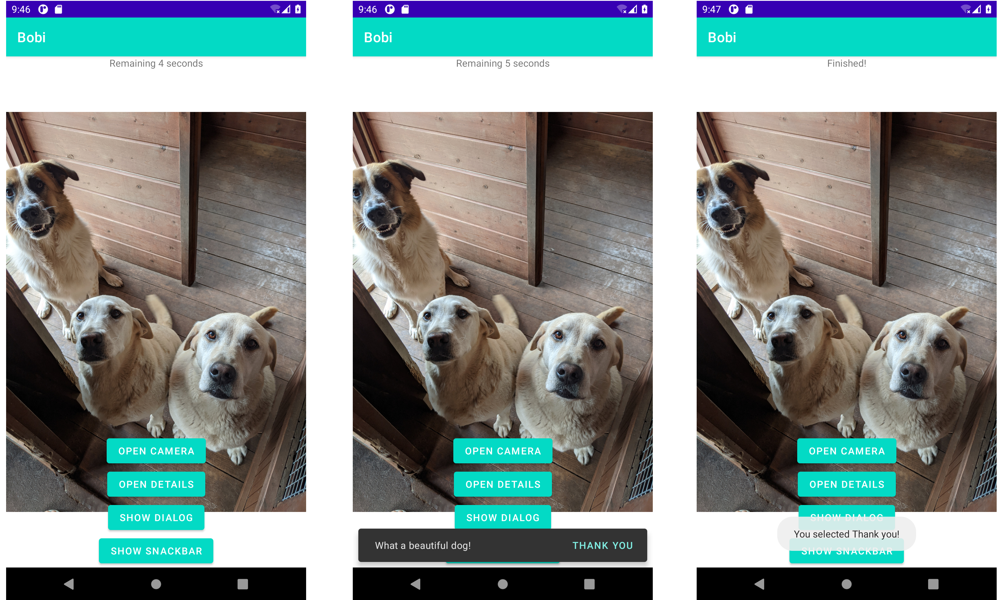

# Aula #2 - Fundações I 🏗

Podes encontrar a apresentação desta aula no speakerdeck do ATP:

👉 [Aula 2](https://speakerdeck.com/atp/android-training-program-portugal-aula-2/)

Para correres estes projectos localmente, basta abrires uma das pastas:
- `02. Aula`
- `02. Exercicio 1`
- `02. Exercicio 2`

Com o Android Studio.

Qualquer questão que tenhas, podes sempre falar connosco a partir do [discord](https://bit.ly/atp2020-discord)

### Aula 2

<h3 align="center">
  
</h3>

### Exercício 1

<h3 align="center">
  
</h3>

### Exercício 2

<h3 align="center">
  
</h3>
